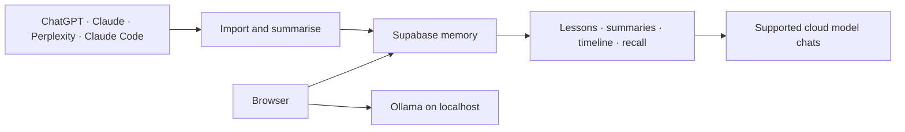

# ChatMemo

<p align="center">
  <strong>One memory across your AI conversations.</strong>
</p>

<p align="center">
  Import conversations from ChatGPT, Claude, Claude Code, and Perplexity.<br />
  Turn them into durable memory, then use that context in new AI chats.
</p>

<p align="center">
  <a href="https://chatmemo-one.vercel.app">Open ChatMemo</a> ·
  <a href="docs/USER_GUIDE.md">User Guide</a> ·
  <a href="docs/ADMIN_GUIDE.md">Admin Guide</a>
</p>

---

ChatMemo is a self-hosted AI memory and chat workspace built on Next.js and Supabase. It collects conversations from different assistants, distils them into summaries and learned context, and makes that history available when you start a new supported cloud-model chat.

It also provides a single interface for built-in AI providers, OpenRouter, secure remote OpenAI-compatible endpoints, and local Ollama models running on your Mac.

## Why ChatMemo

Most AI chats start from zero. Your decisions, preferences, project history, and previous conversations remain fragmented across providers.

ChatMemo gives that context a durable home:

1. **Capture** conversations from multiple sources.
2. **Distil** them into summaries and a self-improving lessons document.
3. **Recall** relevant memories or complete past conversations when needed.
4. **Chat** from one workspace using supported cloud providers or local models.

## Highlights

- **Persistent memory** — supported cloud chat routes receive learned user context and recent conversation summaries.
- **Relevant recall** — ChatMemo searches the history for details related to the current question.
- **Full conversation recovery** — retrieve complete transcripts by title or date when the imported source retains the full text.
- **Multi-source import** — Claude.ai, Claude Code, ChatGPT exports, and Perplexity exports.
- **Self-improving lessons** — a structured knowledge document tracks preferences, active projects, and recurring patterns.
- **Unified timeline** — browse conversations from every source with search, date, and source filters.
- **Multiple model paths** — built-in providers, OpenRouter, remote OpenAI-compatible APIs, and Ollama on macOS.
- **Tools and file retrieval** — attach OpenAPI tools and searchable documents where the selected model supports them.

## How it works



The browser stores authenticated chat history in Supabase. Built-in cloud routes load the user's memory on the server before contacting the selected provider. Ollama follows a separate browser-to-loopback path so the public server never attempts to connect to the Mac's local network.

## Model options

| Model path                        | Where inference runs             | Persistent memory injection |             API tools |
| --------------------------------- | -------------------------------- | --------------------------: | --------------------: |
| Built-in providers and OpenRouter | Provider API                     |                         Yes | OpenAI and OpenRouter |
| Remote OpenAI-compatible model    | Configured public HTTPS endpoint |                     Not yet |                    No |
| Ollama                            | Your Mac via `localhost`         |                     Not yet |                    No |

### Current Ollama limitations

Ollama model discovery and inference run directly between the browser and `localhost:11434`. No Ollama API key is stored or proxied through the ChatMemo server.

However, the current local path does **not** inject ChatMemo's persistent lessons, conversation memory, or full-conversation recall into the Ollama request. API tools are also unavailable with Ollama. The conversation itself is still saved to Supabase through the normal authenticated flow.

Use any built-in cloud route when a chat needs persistent memory. Use OpenAI or OpenRouter when tools are also required. Closing the Ollama gap while keeping inference local is planned follow-up work.

## Privacy and security boundaries

- Supabase Row Level Security scopes chats, memories, files, profiles, and private resources to the authenticated user.
- Remote custom models are loaded through the user's session. Keyed models remain private; only keyless definitions can be shared.
- Shared tools must use public, credential-free HTTPS configuration. Headers, query credentials, authentication schemas, webhook secrets, and embedded tokens keep a tool private.
- Outbound tool and remote-model requests reject loopback and private-network targets, DNS rebinding, unsafe redirects, and oversized responses.
- Ollama provides local **inference**, not fully local ChatMemo storage. Chats and generated memories continue to live in the configured Supabase project.
- `SUPABASE_SERVICE_ROLE_KEY` and `CHATMEMO_IMPORT_TOKEN` are secrets. Never expose them in client code, browser bookmarks exports, logs, or git.

## Quick start

### Prerequisites

| Requirement | Version or plan                   |
| ----------- | --------------------------------- |
| Node.js     | 18 or later                       |
| npm         | 9 or later                        |
| Supabase    | Free tier is sufficient           |
| OpenRouter  | Required for memory summarisation |
| Ollama      | Optional, for local inference     |

### 1. Install ChatMemo

```bash
git clone https://github.com/braisntext/chatmemo.git
cd chatmemo
npm install
cp .env.local.example .env.local
```

### 2. Configure the required environment

```env
NEXT_PUBLIC_SUPABASE_URL=https://<project>.supabase.co
NEXT_PUBLIC_SUPABASE_ANON_KEY=<anon-key>
SUPABASE_SERVICE_ROLE_KEY=<service-role-key>
SUPABASE_PROJECT_REF=<project-ref>

OPENROUTER_API_KEY=sk-or-v1-...

# Required by npm run setup:sync
CHATMEMO_IMPORT_TOKEN=<random-hex-token>

# Optional local inference
NEXT_PUBLIC_OLLAMA_URL=http://localhost:11434
```

Find the Supabase values under **Project Settings → API**. Keep `.env.local` private.

### 3. Apply the database migrations

```bash
npx supabase login
npx supabase link --project-ref <project-ref>
npm run db-push
npm run db-types-remote
```

Use the ordered files in `supabase/migrations/`. Do not paste migrations individually or repair their history unless the existing remote schema has first been audited.

### 4. Start ChatMemo

```bash
npm run dev
```

Open [http://localhost:3000](http://localhost:3000), create an account, and complete the initial workspace setup.

### 5. Connect the import workflow

```bash
npm run setup:sync
```

This configures the Claude Code Stop hook, writes the import user ID to `.env.local`, and prints the Claude.ai bookmarklet URL.

## Local models with Ollama

Install [Ollama](https://ollama.com/download), start it, and download a model:

```bash
ollama pull llama3.2:3b
ollama list
```

Set the endpoint before starting ChatMemo:

```env
NEXT_PUBLIC_OLLAMA_URL=http://localhost:11434
```

Restart ChatMemo and select the model from the **Local** tab. Keep Ollama bound to loopback; do not expose port `11434` to the public internet.

## Import sources

| Source         | Method                                           |          Full transcript recall |
| -------------- | ------------------------------------------------ | ------------------------------: |
| Claude.ai      | Bookmarklet or account export                    |                             Yes |
| Claude Code    | VS Code Stop hook, bulk import, or macOS watcher |                             Yes |
| ChatGPT        | Account export                                   | No, imported text is compressed |
| Perplexity     | Account export                                   |                             Yes |
| ChatMemo chats | Automatic                                        |                             Yes |

See the [User Guide](docs/USER_GUIDE.md#3-importing-conversations) for source-specific instructions, backup, restore, and selective clearing.

## Documentation

| Guide                              | Covers                                                                                   |
| ---------------------------------- | ---------------------------------------------------------------------------------------- |
| [User Guide](docs/USER_GUIDE.md)   | Imports, memory, timeline, models, tools, backup, and everyday usage                     |
| [Admin Guide](docs/ADMIN_GUIDE.md) | Installation, environment, migrations, Ollama, security, troubleshooting, and operations |

## Tech stack

- **Application:** Next.js 14 App Router, TypeScript, Tailwind CSS, shadcn/ui
- **Database and auth:** Supabase Postgres, Storage, Auth, and Row Level Security
- **Memory summarisation:** OpenRouter
- **Chat providers:** OpenAI, Anthropic, Gemini, Mistral, Groq, Perplexity, Azure OpenAI, and OpenRouter
- **Custom models:** public OpenAI-compatible HTTPS endpoints
- **Local inference:** Ollama through the browser

## Useful commands

```bash
npm run dev              # development server
npm test                 # Jest suite
npm run type-check       # TypeScript verification
npm run db-push          # apply linked Supabase migrations
npm run db-types-remote  # regenerate types from the linked database
npm run update           # pull main, apply local migrations, regenerate types
```

## Project lineage

ChatMemo started as a fork of [mckaywrigley/chatbot-ui](https://github.com/mckaywrigley/chatbot-ui) and now adds a multi-source memory pipeline, conversation import and recall, self-improving lessons, timeline browsing, secure custom endpoints, and local-model support.

## License

MIT.
